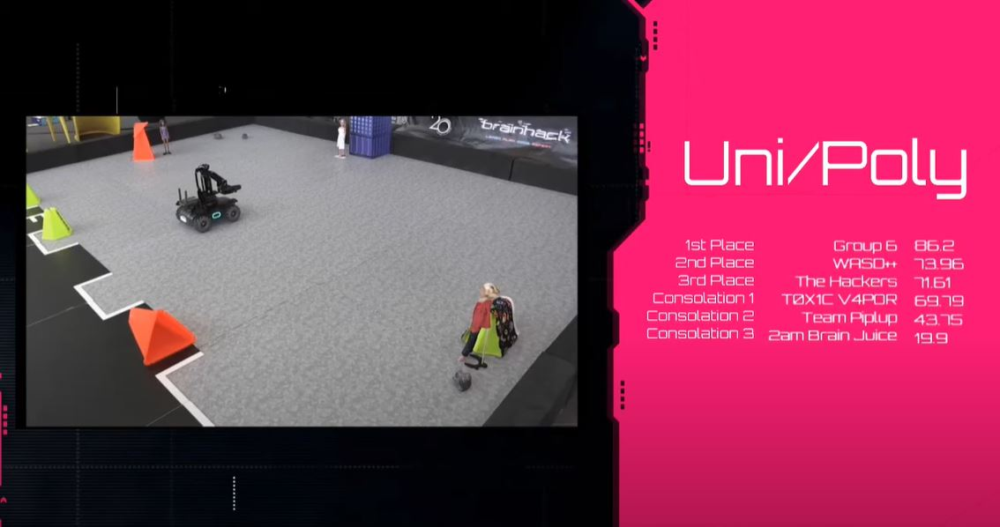

# DSTA_BrainHack2020_TIL_Group6

### Our winning run!

## Task 1
#### Objective
1. Take a picture of the map with the drone.
1. Obtain the shortest path from S (start) to E (end).
1. Robot to traverse that path.
1. Draw the path on the map

#### Implemented Logic
**Target minimap is a 5x5 grid. Top row has 'E', Bottom row has 'S', Middle row has 2 white boxes**
1. Convert RGB image to single channel
1. Obtaining S and E positions
  1. Use a letter detection model to obtain bounding box coordinates of 'S' and 'E'
  1. Using letter coordinates, assign to the relevant box in our minimap.
1. Obtaining obstacle positions
  1. Resize to 24 x 32
  1. Apply a mask on all sides to focus only on the middle.
  1. Use a 5x5 (and 4x4) 'box-edges' filter to identify the coordinates of the middle 2 white squares in the grid.
  1. Using these coordinates, check the 5x5 grids on all sides of each white square to identify if there is an obstacle.
  1. An obstacle is identified is the total number of 1's in each 5x5 box exceeds a threshold
  1. Set the positions on the minimap to be 0 = no obstacle, 1 = obstacle
1. Obtaining path
  1. Apply breadth first search algorithm with nodes as the boxes in our minimap
  1. Based on path, set the instructions as 'front' || 'down' || 'left' || 'right' || 'top' based on the position of the next node
  1. Remove first instruction. (since we preset the robot to move forward to first grid on start)
  1. Replace last instruction with 'end'. (different preset distance)
1. Drawing path
  1. Based on the coordinates of the white squares in the 24x32 grid from before, obtain the x-distance between the 2 squares.
  1. Scale to the actual width of the image and record this distance as one 'grid-distance'
  1. Based on instructions obtained from path, draw the lines with 'grid-distance' as reference for how long each line should be.

## Task 2
#### Objective
1. Given a mission statement, input into NLP model to obtain the desired clothing that the target doll is wearing.
1. Starting from the left, do a 180 degree sweep, identifying all the three dolls and check if it is our target doll. (based on clothing item, should have 1 matching and 2 non-matching)
1. After all three dolls, turn back to the target doll.
1. Move forward and grab the doll

#### Implemented Logic
1. Obtain desired clothing list from NLP model.
1. Move robot forward to middle of arena and turn left.
1. Turn right by 5 degrees each time until 180 degrees (although we had to increase this value because the robot is inconsistent and does not actually turn a full 180 degree)
  1. After each 5 degree turn, apply a doll detection model to check if there is a doll ahead.
  1. If a doll is detected, move forward for a clearer view and apply the fashion detection model to identify the clothing items.
  1. Match our list of predictions with that from the NLP model.
    1. If match, turn green momentarily and move back to original position.
    1. If doesn't match, turn red momentarily and move back to original position.
1. After 180 degree turn.
  1. Turn 5 degree to the left instead, following the same matching logic as above. (i.e. detect a doll and move forward to detect clothing)
  1. If a match is detected, start the grabbing algorithm.
    1. Move toward the doll, applying a proportional controller for adjustments with error term = x coordinate of bounding box of the doll
    1. Move forward until the total area of the bounding box exceeds a threshold. (larger area == closer to the robot)
    1. Grab the doll.
